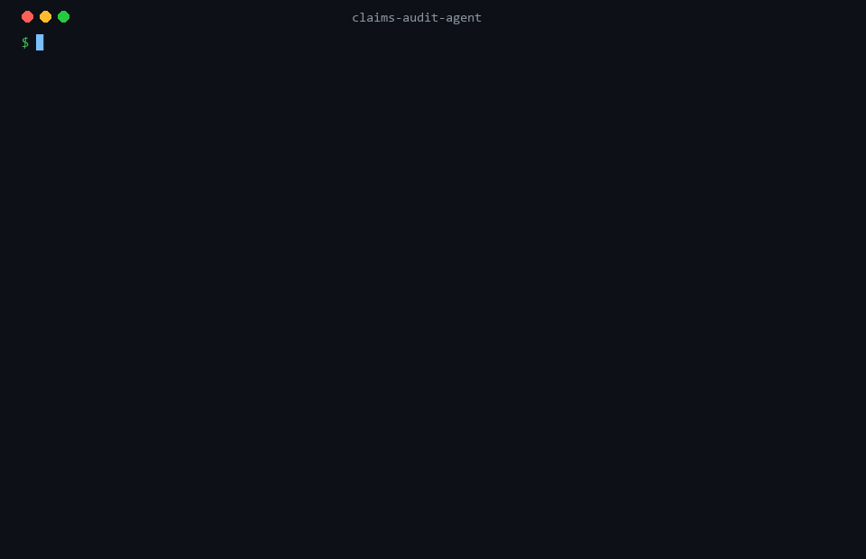
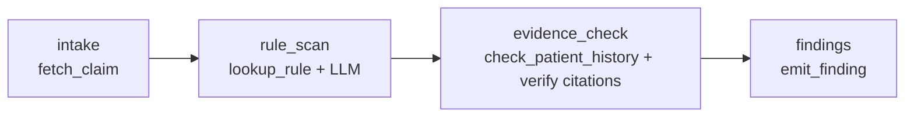

# claims-audit-agent

**A medical-claims line-item auditing agent — built eval-first, then implemented twice: once on [`claude-agent-sdk`](https://github.com/anthropics/claude-agent-sdk-python) and once on [LangGraph](https://github.com/langchain-ai/langgraph), over one shared, deterministic rule core.**

[](https://github.com/sheldon904/claims-audit-agent/actions/workflows/ci.yml)


<p align="center">
  
</p>

The agent reads one claim at a time — CPT codes, units, modifiers, diagnoses, and a free-text provider note — and reports billing defects (unbundling, upcoding, duplicate lines, unit-limit violations, missing modifiers). **Every finding must cite the exact rule it violates and the exact claim lines involved**, or it doesn't count.

> **No real health data anywhere.** Every patient, provider, note, and code relationship is synthetic. CPT numbers appear only as opaque identifiers whose meaning is fully defined by [`rules/audit_rules.yaml`](rules/audit_rules.yaml) — no AMA descriptor data or proprietary NCCI edit tables are bundled.

---

## The one thing this repo is actually about: the eval came first

The harness, the frozen holdout, and the metrics were built **before** either agent. That ordering is the whole point. You cannot tell whether an agent is good without a scorer that is harder to fool than the agent, so the scorer is the primary artifact and the agents are swappable arms behind it.

Three properties make the ground truth trustworthy:

1. **Clean by construction.** The [data generator](data/generate.py) assembles non-defective claims only from combinations the rules cannot flag, then injects *exactly-known* defects into 40 of 200 claims.
2. **Double-entry ground truth.** After generation, an independent [deterministic engine](claims_audit/engine.py) re-derives findings from the claim + rules alone. Generation **fails hard** unless the engine's output equals the injected labels on every claim. Labels and an independent checker must agree before anything is written to disk — the same two-database-holdout discipline used to trust a compliance engine against statute.
3. **Citation-first metrics.** Beyond precision/recall we measure **fabrication rate** (findings citing a rule or line that does not exist) and **citation validity**. A confident-but-hallucinated finding is the failure mode that matters in claims audit, so it gets its own number.

```
data/  ── 200 synthetic claims, 40 defective (10 unbundling · 9 units · 8 upcoding · 7 duplicate · 6 missing-modifier)
       └─ 25-claim frozen holdout (15 defective covering all 5 categories, 10 clean incl. tempting true-negatives)
```

---

## Results

The **deterministic engine** arm is measured on every push in CI and is the row the [regression gate](evals/gate.py) enforces. It is not an LLM — it is the shared rule core wrapped as an eval arm, and by the clean-by-construction guarantee it *should* be perfect. When it isn't, a rule or the data drifted and the build goes red.

### Frozen holdout (25 claims) — measured

The LangGraph arm was benchmarked live through **OpenRouter** on a cheap open-source model (`qwen/qwen3-32b`, ~$0.08/$0.28 per M tokens); the whole run below cost **~$0.011**. The engine row is measured in CI on every push.

| SDK / Arm | Thinking | Model | Precision | Recall | F1 | Citation valid. | Fabrication | Latency | $/claim |
| --- | --- | --- | --- | --- | --- | --- | --- | --- | --- |
| **engine (deterministic)** | n/a | n/a | **1.000** | **1.000** | **1.000** | **1.000** | **0.000** | <1 ms | $0.00000 |
| langgraph · openrouter | off | qwen/qwen3-32b | 0.737 | 0.933 | 0.824 | **1.000** | **0.000** | 3.7 s | $0.00017 |
| langgraph · openrouter | on | qwen/qwen3-32b | 1.000 | 0.467 | 0.636 | **1.000** | **0.000** | 10.8 s | $0.00025 |
| claude-agent-sdk | off | — | — | — | — | — | — | — | — |
| claude-agent-sdk | on | — | — | — | — | — | — | — | — |

**What's real and what isn't, stated plainly:**

- **Fabrication rate is 0.000 and citation validity 1.000 for the LLM arm in both modes** — even though the raw model over- and under-flags. That is not luck: the LangGraph `evidence_check` node verifies every cited rule id and line span against the claim and drops anything unsupported, so a hallucinated citation can never reach a finding. This is the headline result — the property that matters for a claims auditor is structurally guaranteed, not hoped for.
- **The `claude-agent-sdk` rows are `—` and honestly so.** That SDK drives the Claude Code CLI, which expects native Anthropic; it would not route cheap OSS models through OpenRouter's Anthropic-compatible endpoint in my environment (it errors), and running it natively means Anthropic spend I was asked to avoid. Its orchestration is proven end-to-end offline in CI (`tests/test_agents_offline.py`); a live benchmark needs `ANTHROPIC_API_KEY` + `make eval-llm`. I'd rather ship an accurate blank than a number I can't stand behind — which is the entire point of the project.

### The reasoning-model arm — an actual, surprising delta

Turning thinking **on** did **not** uniformly help — it traded recall for precision, and cost 3× the latency:

| | precision | recall | latency | cost/claim |
| --- | --- | --- | --- | --- |
| thinking **off** | 0.737 | **0.933** | 3.7 s | $0.00017 |
| thinking **on**  | **1.000** | 0.467 | 10.8 s | $0.00025 |

With reasoning enabled, `qwen/qwen3-32b` became far more conservative: it stopped over-flagging (precision 0.74 → 1.00) but also second-guessed real defects (recall 0.93 → 0.47). For a *first-pass* auditor that feeds human reviewers, the thinking-**off** configuration is the better operating point here — higher recall, one-third the latency, lower cost — which is exactly the kind of finding you only get from measuring rather than assuming. Swapping to Claude is one env var (`OPENROUTER_MODEL=anthropic/claude-sonnet-4.5`, or native `make eval-llm`); this arm is cheap to re-run on any model OpenRouter serves.

---

## Architecture: one core, two orchestrations

Everything that isn't orchestration lives in [`claims_audit/`](claims_audit/) — the Pydantic models, the YAML rule set, the deterministic engine, the four tools, and the metrics. The two agents are **thin ports** over that core, which is what makes them comparable: any accuracy difference is orchestration, not prompt or logic drift.

```
claims_audit/         shared core (no LLM, no I/O)
  models.py           Claim / ClaimLine / Finding  (Finding is the structured-output contract)
  rules.py + engine   YAML rules → typed Rule objects → deterministic RuleEngine
  tools.py            fetch_claim · lookup_rule · check_patient_history · emit_finding
  metrics.py          precision / recall / fabrication / citation-validity
agent_sdk/            Agent v1 — autonomous tool loop on claude-agent-sdk
agent_graph/          Agent v2 — explicit graph on LangGraph
providers/            provider factory — Anthropic or OpenRouter, resolved from env
evals/                harness · deterministic baseline · gate · runner · reporting
data/ · rules/        synthetic generator + frozen sets · machine-readable rules
```

### The four tools (identical across both agents)

`fetch_claim`, `lookup_rule`, `check_patient_history`, and `emit_finding` are implemented once in [`claims_audit/tools.py`](claims_audit/tools.py). `agent_sdk` registers them as in-process `@tool` handlers; `agent_graph` calls the same functions from graph nodes.

`emit_finding` takes a **Pydantic model validated against JSON Schema** — the structured-output contract, `extra="forbid"`, `line_refs` non-empty:

```python
class Finding(BaseModel):
    model_config = {"extra": "forbid"}
    claim_id: str
    rule_id: str                      # must be a real rule id
    defect_type: DefectType           # enum
    line_refs: list[str] = Field(min_length=1)   # must be real claim lines
    severity: Severity = Severity.MEDIUM
    rationale: str = ""
```

Note the deliberate seam: `emit_finding` validates *structure* but records a structurally-valid finding even if it cites a non-existent rule or line. Silently dropping those would make the fabrication metric meaningless — catching them is the metric's job, not the tool's.

### Agent v1 — `claude-agent-sdk` (autonomous tool loop)

The model is handed the four tools as an in-process MCP server and drives itself: `fetch_claim` → `lookup_rule` → (read the note) → `emit_finding` per defect. Control flow is the model's. Extended thinking toggles via `max_thinking_tokens`. ([`agent_sdk/agent.py`](agent_sdk/agent.py))

### Agent v2 — LangGraph (explicit graph)

The same four tools, re-sequenced as a fixed graph. The LLM is used only where judgment is required (`rule_scan`); everything else is code.



`evidence_check` verifies every candidate's citation against the real rule set and claim lines and **drops anything unsupported** — which is why this arm's **measured fabrication rate is 0.000 in both thinking modes** (see Results) regardless of what the model proposes. The chat model is injectable, so the whole graph runs offline in tests. ([`agent_graph/graph.py`](agent_graph/graph.py))

### The money section — porting one auditor onto three runtimes

This started as a port of a custom invoice-scoring runtime. Re-implementing the *same* auditor three ways surfaced the real trade:

- **Custom runtime → shared core.** The port forced the honest question "what here is orchestration and what is the audit?" The answer became `claims_audit/`: models, rules, engine, tools, metrics — zero framework imports. Once that seam existed, both SDK ports were ~150 lines each. **The most valuable artifact was the boundary, not either agent.**
- **claude-agent-sdk** is the least code and the most capability: in-process typed tools, structured output via tool schema, thinking as one field. The cost is that control flow lives in the model — great for open-ended audit, harder to *bound* and to unit-test without a live model.
- **LangGraph** inverts it: more wiring, but control flow is data you can read, and the natural place for a deterministic `evidence_check` node makes hallucinated citations structurally impossible to emit. It's the arm I'd ship where "never fabricate a citation" is a hard requirement — and it's fully testable offline with an injected model.
- **The eval outlived all three.** Because the harness scores any `audit(claim) -> list[Finding]`, swapping runtimes never touched a line of scoring. Build the scorer first and the agent becomes an implementation detail — which is exactly the point.

---

## Quickstart

```bash
python -m venv .venv && source .venv/bin/activate      # Windows: .venv\Scripts\activate
pip install -e ".[dev]"        # core + tests, NO LLM SDKs, NO API key needed

make data      # regenerate the deterministic dataset (self-verifies against the engine)
make test      # 46 tests
make gate      # the eval regression gate — engine on the frozen holdout
make eval      # print the engine results table
```

Run the LLM arms (needs the extras and a key):

```bash
pip install -e ".[dev,sdk,graph,openrouter]"      # or: make install-llm
cp .env.example .env                               # add your key

# via OpenRouter (recommended — any model, your credits):
export OPENROUTER_API_KEY=sk-or-...
make eval-openrouter    # both SDKs, thinking on/off — rewrites the results table

# or native Anthropic:
export ANTHROPIC_API_KEY=sk-...
make eval-llm
```

### Inference backend — Anthropic or OpenRouter

The LLM arms are provider-agnostic ([`providers/chat.py`](providers/chat.py)). The backend is resolved from config/env — explicit `--provider` → `$LLM_PROVIDER` → OpenRouter if `$OPENROUTER_API_KEY` is set → Anthropic:

| | native Anthropic | OpenRouter |
| --- | --- | --- |
| **LangGraph arm** | `ChatAnthropic` | `ChatOpenAI` → `openrouter.ai/api/v1` (OpenAI-compatible) — **fully supported** |
| **claude-agent-sdk arm** | Claude Code CLI, native | CLI pointed at OpenRouter's Anthropic-compatible endpoint via `ANTHROPIC_BASE_URL` — experimental |
| **thinking** | `thinking={budget_tokens}` | OpenRouter unified `reasoning={max_tokens}` |
| **model id** | `claude-sonnet-5` | `anthropic/claude-sonnet-4.5` (or any OpenRouter id via `$OPENROUTER_MODEL`) |

Canonical names map to OpenRouter ids automatically (`OPENROUTER_MODEL_MAP`); set `$OPENROUTER_MODEL` to run any model OpenRouter serves — including non-Anthropic models — through the same harness. A repo-root `.env` (see [`.env.example`](.env.example)) is auto-loaded.

## CI regression gate

[`.github/workflows/ci.yml`](.github/workflows/ci.yml) runs on every push/PR:

- **`gate`** (Python 3.10/3.11/3.12): ruff · asserts the committed data isn't stale (`data/` must equal a fresh generation) · `pytest` · **`python -m evals.gate`**, which fails the build if precision, recall, or citation validity regress or fabrication rate rises above 0 on the holdout.
- **`agents-offline`**: installs both LLM SDK extras and runs the agents end-to-end against a scripted model — no API key — proving both import and the graph executes.

The gate is intentionally scored on the deterministic arm: it must be **free and reproducible on every commit**. The non-deterministic, billable LLM arms are reported, not gated.

## Limitations (the honest note)

- **The engine's upcoding check is keyword-based.** For the synthetic notes it's exact, which is why the engine is perfect on the holdout. Real notes are where an LLM arm should pull ahead — quantifying that gap is what the reasoning-model arm is for.
- **The LangGraph arm is benchmarked on a cheap OSS model** (`qwen/qwen3-32b`) to keep the run near-free (~$0.011). A stronger model (Claude, GPT, etc.) is a one-line change; the numbers in the table are that specific model's, not a ceiling.
- **The `claude-agent-sdk` arm is not benchmarked live** — it requires native Anthropic (its Claude Code CLI doesn't route through OpenRouter). Its orchestration is verified offline in CI; `make eval-llm` with `ANTHROPIC_API_KEY` fills its rows.
- **Synthetic ≠ production.** 15 rules and 200 claims are a demonstration substrate, not a payer-grade edit library.

## License

MIT — see [LICENSE](LICENSE).
