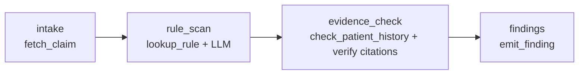

# claims-audit-agent

**A medical-claims line-item auditing agent — built eval-first, then implemented three times: on [`claude-agent-sdk`](https://github.com/anthropics/claude-agent-sdk-python), on [LangGraph](https://github.com/langchain-ai/langgraph), and on the [Vercel AI SDK](https://ai-sdk.dev) (TypeScript), over one shared, deterministic rule core.**

[](https://github.com/sheldon904/claims-audit-agent/actions/workflows/ci.yml)


**Live comparison UI:** [claims-audit-agent.vercel.app](https://claims-audit-agent.vercel.app) — the three-way results table and the honest substrate write-up, deployed on Vercel.

<p align="center">
  
</p>

The agent reads one claim at a time — CPT codes, units, modifiers, diagnoses, and a free-text provider note — and reports billing defects (unbundling, upcoding, duplicate lines, unit-limit violations, missing modifiers). **Every finding must cite the exact rule it violates and the exact claim lines involved**, or it doesn't count.

> **No real health data anywhere.** Every patient, provider, note, and code relationship is synthetic. CPT numbers appear only as opaque identifiers whose meaning is fully defined by [`rules/audit_rules.yaml`](rules/audit_rules.yaml) — no AMA descriptor data or proprietary NCCI edit tables are bundled.

---

## The one thing this repo is actually about: the eval came first

The harness, the frozen holdout, and the metrics were built **before** either agent. That ordering is the whole point. You cannot tell whether an agent is good without a scorer that is harder to fool than the agent, so the scorer is the primary artifact and the agents are swappable arms behind it.

Three properties make the ground truth trustworthy:

1. **Clean by construction.** The [data generator](data/generate.py) assembles non-defective claims only from combinations the rules cannot flag, then injects *exactly-known* defects into 40 of 200 claims.
2. **Double-entry ground truth.** After generation, an independent [deterministic engine](claims_audit/engine.py) re-derives findings from the claim + rules alone. Generation **fails hard** unless the engine's output equals the injected labels on every claim. Labels and an independent checker must agree before anything is written to disk — the same two-database-holdout discipline used to trust a compliance engine against statute.
3. **Citation-first metrics.** Beyond precision/recall we measure **fabrication rate** (findings citing a rule or line that does not exist) and **citation validity**. A confident-but-hallucinated finding is the failure mode that matters in claims audit, so it gets its own number.

```
data/  ── 200 synthetic claims, 40 defective (10 unbundling · 9 units · 8 upcoding · 7 duplicate · 6 missing-modifier)
       └─ 25-claim frozen holdout (15 defective covering all 5 categories, 10 clean incl. tempting true-negatives)
```

---

## Results

The **deterministic engine** arm is measured on every push in CI and is the row the [regression gate](evals/gate.py) enforces. It is not an LLM — it is the shared rule core wrapped as an eval arm, and by the clean-by-construction guarantee it *should* be perfect. When it isn't, a rule or the data drifted and the build goes red.

### Frozen holdout (25 claims) — measured

**All three** LLM arms were benchmarked live through **OpenRouter** on the *same* cheap open-source model (`qwen/qwen3-32b`, ~$0.08/$0.28 per M tokens) so the comparison is apples-to-apples. The two LangGraph runs cost **~$0.008** together; the two Vercel-AI-SDK runs **~$0.03**; the `claude-agent-sdk` holdout pass costs **~$0.08** on its own (~18× the per-claim cost — see the note below). The engine row is measured in CI on every push.

| SDK / Arm | Thinking | Model | Precision | Recall | F1 | Citation valid. | Fabrication | Latency | $/claim |
| --- | --- | --- | --- | --- | --- | --- | --- | --- | --- |
| **engine (deterministic)** | n/a | n/a | **1.000** | **1.000** | **1.000** | **1.000** | **0.000** | <1 ms | $0.00000 |
| langgraph · openrouter | off | qwen/qwen3-32b | 0.750 | **1.000** | 0.857 | **1.000** | **0.000** | 3.6 s | $0.00018 |
| langgraph · openrouter | on | qwen/qwen3-32b | **1.000** | 0.600 | 0.750 | **1.000** | **0.000** | 1.5 s | $0.00016 |
| claude-agent-sdk · openrouter | off | qwen/qwen3-32b | **1.000** | **1.000** | **1.000** | **1.000** | **0.000** | 54.3 s | $0.00324 |
| claude-agent-sdk · openrouter | on | qwen/qwen3-32b | — | — | — | — | — | — | — |
| **vercel-ai-sdk · openrouter** | off | qwen/qwen3-32b | 0.714 | **1.000** | 0.833 | **1.000** | **0.000** | 15.3 s | $0.00063 |
| **vercel-ai-sdk · openrouter** | on | qwen/qwen3-32b | 0.938 | **1.000** | 0.968 | **1.000** | **0.000** | 11.9 s | $0.00059 |

**What's real and what isn't, stated plainly:**

- **Fabrication rate is 0.000 and citation validity 1.000 for the LangGraph arm in both modes** — even though the raw model over- and under-flags. That is not luck: the LangGraph `evidence_check` node verifies every cited rule id and line span against the claim and drops anything unsupported, so a hallucinated citation can never reach a finding. This is the headline result — the property that matters for a claims auditor is structurally guaranteed, not hoped for.
- **The `claude-agent-sdk` arm now routes through OpenRouter too — and its honest caveat is cost and stability, not capability.** This arm was blank at first because the Claude Code CLI it drives wouldn't reach OpenRouter's Anthropic-compatible endpoint in my environment. That turned out to be a bug, now fixed: the CLI appends `/v1/messages` to `ANTHROPIC_BASE_URL`, so the base must *not* already end in `/v1`, and auth must be a lone bearer token (`ANTHROPIC_AUTH_TOKEN`, not a conflicting `ANTHROPIC_API_KEY`). With the fix it scored a **perfect holdout** (P/R/F1 = 1.000) on the same `qwen/qwen3-32b` — but at **~54 s/claim (≈15× the LangGraph arm) and ~18× the cost**, because it spawns a fresh Claude Code CLI subprocess per claim. That subprocess is also flaky against a third-party endpoint: on a re-run ~half of the first claims hung, each bounded by a per-claim timeout that degrades a wedged subprocess to *no findings* instead of crashing the run. So this arm is **demonstrated on the holdout, not run at full scale** (and its `thinking on` row is left unmeasured for the same reason) — the trade is cost/latency/stability, not correctness. Full write-up in [`docs/STATUS.md`](docs/STATUS.md).
- **The Vercel AI SDK arm (TypeScript) is the third substrate — measured on the same frozen holdout and the same model.** It caught **every** injected defect in both modes (recall 1.000) with **0.000 fabrication and 1.000 citation validity**. Unlike the LangGraph arm, that clean-citation result is *not* structurally guaranteed — this arm has no `evidence_check` node; like the `claude-agent-sdk` arm it lets the model drive and trusts the strict Zod schema, so the zero is earned by the model, not enforced. The reasoning delta is the interesting part: turning thinking **on** *raised* precision (0.714 → 0.938) by cutting over-flagging (6 false positives → 1) **while keeping recall at 1.000** — the *opposite* trade from the LangGraph arm, where thinking-on gave up recall for precision. Same model, different orchestration, different reasoning behaviour: exactly the kind of thing you only learn by measuring. Details in [`agent_aisdk/`](agent_aisdk/) and the substrate comparison below.

### The reasoning-model arm — an actual, measured delta

Turning thinking **on** did **not** uniformly help — it cleanly traded recall for precision:

| | precision | recall | latency | cost/claim |
| --- | --- | --- | --- | --- |
| thinking **off** | 0.750 | **1.000** | 3.6 s | $0.00018 |
| thinking **on**  | **1.000** | 0.600 | 1.5 s | $0.00016 |

With reasoning enabled, `qwen/qwen3-32b` became far more conservative: it stopped over-flagging (precision 0.75 → 1.00) but also second-guessed real defects (recall 1.00 → 0.60). Latency and cost were a wash here — thinking-*on* even edged out slightly cheaper, because its conservatism emitted fewer findings and therefore fewer tokens (a good reminder that "reasoning = slower and pricier" is not a law). For a *first-pass* auditor that feeds human reviewers, thinking-**off** is the better operating point on this data: it caught **every** defect (recall 1.000), and a downstream human discards the occasional false positive far more cheaply than re-discovering a missed one. That's exactly the kind of finding you only get from measuring rather than assuming. Swapping to Claude is one env var (`OPENROUTER_MODEL=anthropic/claude-sonnet-4.5`, or native `make eval-llm`); this arm is cheap to re-run on any model OpenRouter serves.

---

## Architecture: one core, three orchestrations

Everything that isn't orchestration lives in [`claims_audit/`](claims_audit/) — the Pydantic models, the YAML rule set, the deterministic engine, the four tools, and the metrics. The three agents are **thin ports** over that core, which is what makes them comparable: any accuracy difference is orchestration, not prompt or logic drift. The TypeScript arm reuses the *same* frozen `data/` and `rules/` files (it never re-encodes them) and emits findings in the exact JSON the canonical Python harness consumes, so scoring stays identical across languages.

```
claims_audit/         shared core (no LLM, no I/O)
  models.py           Claim / ClaimLine / Finding  (Finding is the structured-output contract)
  rules.py + engine   YAML rules → typed Rule objects → deterministic RuleEngine
  tools.py            fetch_claim · lookup_rule · check_patient_history · emit_finding
  metrics.py          precision / recall / fabrication / citation-validity
agent_sdk/            Agent v1 — autonomous tool loop on claude-agent-sdk (Python)
agent_graph/          Agent v2 — explicit graph on LangGraph (Python)
agent_aisdk/          Agent v3 — autonomous tool loop on the Vercel AI SDK (TypeScript)
  src/                Zod models · four tools · agent loop · provider · MCP client · CLI
  eval/               canonical-harness runner + offline smoke eval (Python glue)
providers/            provider factory — Anthropic or OpenRouter, resolved from env
evals/                harness · deterministic baseline · gate · runner · reporting
web/                  the deployed comparison UI (static, Vercel)
data/ · rules/        synthetic generator + frozen sets · machine-readable rules
```

### The four tools (identical across all three agents)

`fetch_claim`, `lookup_rule`, `check_patient_history`, and `emit_finding` are implemented once in [`claims_audit/tools.py`](claims_audit/tools.py). `agent_sdk` registers them as in-process `@tool` handlers; `agent_graph` calls the same functions from graph nodes; `agent_aisdk` reimplements them in TypeScript with `tool()` + Zod, field-for-field with the Pydantic contract.

`emit_finding` takes a **Pydantic model validated against JSON Schema** — the structured-output contract, `extra="forbid"`, `line_refs` non-empty:

```python
class Finding(BaseModel):
    model_config = {"extra": "forbid"}
    claim_id: str
    rule_id: str                      # must be a real rule id
    defect_type: DefectType           # enum
    line_refs: list[str] = Field(min_length=1)   # must be real claim lines
    severity: Severity = Severity.MEDIUM
    rationale: str = ""
```

Note the deliberate seam: `emit_finding` validates *structure* but records a structurally-valid finding even if it cites a non-existent rule or line. Silently dropping those would make the fabrication metric meaningless — catching them is the metric's job, not the tool's.

### Agent v1 — `claude-agent-sdk` (autonomous tool loop)

The model is handed the four tools as an in-process MCP server and drives itself: `fetch_claim` → `lookup_rule` → (read the note) → `emit_finding` per defect. Control flow is the model's. Extended thinking toggles via `max_thinking_tokens`. ([`agent_sdk/agent.py`](agent_sdk/agent.py))

### Agent v2 — LangGraph (explicit graph)

The same four tools, re-sequenced as a fixed graph. The LLM is used only where judgment is required (`rule_scan`); everything else is code.



`evidence_check` verifies every candidate's citation against the real rule set and claim lines and **drops anything unsupported** — which is why this arm's **measured fabrication rate is 0.000 in both thinking modes** (see Results) regardless of what the model proposes. The chat model is injectable, so the whole graph runs offline in tests. ([`agent_graph/graph.py`](agent_graph/graph.py))

### Agent v3 — Vercel AI SDK (autonomous tool loop, TypeScript)

The same auditor again, this time in strict TypeScript on the [Vercel AI SDK](https://ai-sdk.dev). Like `agent_sdk` (and unlike the LangGraph graph) the model drives an autonomous loop: it is handed the four tools via `tool()` + Zod and calls `fetch_claim` / `lookup_rule` / `check_patient_history` to gather evidence and `emit_finding` per defect. The loop is `generateText` with `stopWhen: stepCountIs(maxSteps)` — the bound is one explicit line. The Zod `Finding` mirrors the Pydantic model field-for-field (`.strict()` = `extra="forbid"`, non-empty `line_refs`, defaulted `severity`/`rationale`), and `emit_finding` preserves the same seam: it validates *structure* only and records a structurally-valid finding even if it cites a non-existent rule or line, so the fabrication metric stays meaningful.

It runs on the **same model as the other arms** — `qwen/qwen3-32b` through OpenRouter's Anthropic-compatible endpoint, reached via `@ai-sdk/anthropic` (`createAnthropic({ baseURL, authToken })`). A CLI ([`agent_aisdk/src/cli.ts`](agent_aisdk/src/cli.ts)) takes claim ids and emits findings as JSON in the exact shape the Python harness consumes; a small Python runner ([`agent_aisdk/eval/run_eval.py`](agent_aisdk/eval/run_eval.py)) feeds that JSON straight into the **canonical, unmodified** `score_dataset` / `ArmResult` / `arm_row` — so the harness stays the single source of truth for every metric, cost figure, and table cell. A first-class offline mock model lets the whole loop (tools, validation, JSON, scoring) run deterministically in CI with no key.

### Three substrates, honestly compared

Same tools, same prompt, same frozen holdout, same model. Where each one helps and where each one fights you:

| | claude-agent-sdk | LangGraph | Vercel AI SDK |
| --- | --- | --- | --- |
| **language** | Python | Python | TypeScript |
| **schema handling** | type hints → tool schema; Pydantic `Finding` | JSON-schema forced tool; Pydantic core | **Zod** `Finding`, field-for-field with Pydantic; `.strict()` == `extra="forbid"` |
| **loop control** | model-driven, implicit; `max_turns` | explicit graph you can read; hard-wired node order | model-driven, but bounded by one line — `stopWhen: stepCountIs(n)` |
| **fabrication** | model-trusted (no prune) | **structurally 0** — `evidence_check` drops unsupported citations | model-trusted (no prune); strict Zod rejects malformed, not unsupported |
| **observability** | opaque — flow lives in the model | best — every node inspectable, injectable model | typed `steps[]` + per-call usage; official mock model for offline tests |
| **where it fights you** | hard to bound / unit-test offline; subprocess-per-claim is slow + flaky | most wiring; you hand-build control flow | Zod↔JSON-schema quirks; an *unknown* model id (qwen) trips a `maxOutputTokens` compatibility clamp you must set explicitly |

The headline honest point: **Zod vs. Pydantic is a wash for correctness** — both give a strict, non-empty-`line_refs`, extra-forbidden contract, and both produced 0.000 fabrication here. The real difference is *loop control and where the fabrication guarantee lives*. LangGraph earns its 0.000 **structurally** (a node prunes bad citations); the two autonomous arms (claude-agent-sdk, Vercel AI SDK) earn it from the model plus a strict schema — which is why, if you must *never* fabricate a citation, the graph is still the arm to ship.

### One tool through the AI SDK's MCP client

One tool is wired through the AI SDK's MCP client (`@ai-sdk/mcp`, `createMCPClient`) to a **separate, real MCP server** — the repo owner's [`sparql-mcp`](https://github.com/sheldon904/sparql-mcp), an Express + SSE server exposing a read-only SPARQL endpoint as agent tools. Running `MCP_SPARQL_URL=http://127.0.0.1:4002/sse npm run mcp:probe` connects over SSE, discovers its four tools (`sparql_query`, `sparql_ask`, `list_graphs`, `describe_entity`), and writes their schemas to the committed artifact [`agent_aisdk/artifacts/mcp-sparql-tools.json`](agent_aisdk/artifacts/mcp-sparql-tools.json); `node dist/cli.js <claim> --mcp <url>` merges those tools into the agent's toolset. This is kept **out of the scored audit loop** on purpose — the benchmark must stay reproducible without any external server, so the four audit tools remain in-process. (Tool *discovery* is served by the MCP server itself and needs no upstream SPARQL store, which is what makes the demo reproducible.)

### The money section — porting one auditor onto three runtimes

This started as a port of a custom invoice-scoring runtime. Re-implementing the *same* auditor three ways surfaced the real trade:

- **Custom runtime → shared core.** The port forced the honest question "what here is orchestration and what is the audit?" The answer became `claims_audit/`: models, rules, engine, tools, metrics — zero framework imports. Once that seam existed, both SDK ports were ~150 lines each. **The most valuable artifact was the boundary, not either agent.**
- **claude-agent-sdk** is the least code and the most capability: in-process typed tools, structured output via tool schema, thinking as one field. The cost is that control flow lives in the model — great for open-ended audit, harder to *bound* and to unit-test without a live model.
- **LangGraph** inverts it: more wiring, but control flow is data you can read, and the natural place for a deterministic `evidence_check` node makes hallucinated citations structurally impossible to emit. It's the arm I'd ship where "never fabricate a citation" is a hard requirement — and it's fully testable offline with an injected model.
- **Vercel AI SDK** crosses the language boundary: a strict-TypeScript arm that reuses the *same frozen data, rules, prompt, and model* and reports through the *same* Python harness. Zod gives the same guarantees as Pydantic; the loop is the SDK's `generateText` bounded by `stopWhen: stepCountIs`. It proved the seam is language-agnostic — the boundary, not any one agent, is the asset. It's also the arm with the cleanest offline-test story of the two autonomous ones (a first-class mock model), and where the reasoning-on delta *helped* rather than hurt.
- **The eval outlived every arm.** Because the harness scores any `audit(claim) -> list[Finding]` (or the JSON equivalent), swapping runtimes — even swapping *languages* — never touched a line of scoring. Build the scorer first and the agent becomes an implementation detail — which is exactly the point.

---

## Quickstart

```bash
python -m venv .venv && source .venv/bin/activate      # Windows: .venv\Scripts\activate
pip install -e ".[dev]"        # core + tests, NO LLM SDKs, NO API key needed

make data      # regenerate the deterministic dataset (self-verifies against the engine)
make test      # 46 tests
make gate      # the eval regression gate — engine on the frozen holdout
make eval      # print the engine results table
```

Run the LLM arms (needs the extras and a key):

```bash
pip install -e ".[dev,sdk,graph,openrouter]"      # or: make install-llm
cp .env.example .env                               # add your key

# via OpenRouter (recommended — any model, your credits):
export OPENROUTER_API_KEY=sk-or-...
make eval-openrouter    # both SDKs, thinking on/off — rewrites the results table

# or native Anthropic:
export ANTHROPIC_API_KEY=sk-...
make eval-llm
```

### The Vercel AI SDK arm (TypeScript) — reproduce its numbers

A stranger can reproduce the two `vercel-ai-sdk` rows with documented commands. Node ≥ 20 required; it reads the *same* repo-root `.env` (`OPENROUTER_API_KEY`, `OPENROUTER_MODEL=qwen/qwen3-32b`).

```bash
cd agent_aisdk
npm ci                 # exact pinned versions (package-lock.json)
npm run typecheck      # tsc --noEmit, strict, no `any`
npm run lint           # eslint (no-explicit-any is an error)
npm test               # vitest — tool schemas, loop termination, MCP wiring
npm run build          # compile src/ → dist/
cd ..

# offline, deterministic, no key (this is exactly what CI's smoke eval runs):
python agent_aisdk/eval/smoke_eval.py

# the live holdout rows, scored by the canonical Python harness (needs the key):
python agent_aisdk/eval/run_eval.py --dataset holdout --provider openrouter --thinking off
python agent_aisdk/eval/run_eval.py --dataset holdout --provider openrouter --thinking on
```

Each live run writes its committed evidence under [`agent_aisdk/artifacts/`](agent_aisdk/artifacts/) (the raw per-claim findings the CLI emitted, plus the scored row); those artifacts are what back the README table.

### Inference backend — Anthropic or OpenRouter

The LLM arms are provider-agnostic ([`providers/chat.py`](providers/chat.py)). The backend is resolved from config/env — explicit `--provider` → `$LLM_PROVIDER` → OpenRouter if `$OPENROUTER_API_KEY` is set → Anthropic:

| | native Anthropic | OpenRouter |
| --- | --- | --- |
| **LangGraph arm** | `ChatAnthropic` | `ChatOpenAI` → `openrouter.ai/api/v1` (OpenAI-compatible) — **fully supported** |
| **claude-agent-sdk arm** | Claude Code CLI, native | CLI pointed at OpenRouter's Anthropic-compatible endpoint via `ANTHROPIC_BASE_URL` (strip a trailing `/v1`; bearer `ANTHROPIC_AUTH_TOKEN`) — works, but ~15× the latency/cost (subprocess per claim) |
| **Vercel AI SDK arm** | `@ai-sdk/anthropic` `createAnthropic` | same provider pointed at `openrouter.ai/api/v1` (POSTs `/messages`) with a bearer `authToken` — **fully supported** |
| **thinking** | `thinking={budget_tokens}` | OpenRouter unified `reasoning={max_tokens}` |
| **model id** | `claude-sonnet-5` | `anthropic/claude-sonnet-4.5` (or any OpenRouter id via `$OPENROUTER_MODEL`) |

Canonical names map to OpenRouter ids automatically (`OPENROUTER_MODEL_MAP`); set `$OPENROUTER_MODEL` to run any model OpenRouter serves — including non-Anthropic models — through the same harness. A repo-root `.env` (see [`.env.example`](.env.example)) is auto-loaded.

## CI regression gate

[`.github/workflows/ci.yml`](.github/workflows/ci.yml) runs on every push/PR:

- **`gate`** (Python 3.10/3.11/3.12): ruff · asserts the committed data isn't stale (`data/` must equal a fresh generation) · `pytest` · **`python -m evals.gate`**, which fails the build if precision, recall, or citation validity regress or fabrication rate rises above 0 on the holdout.
- **`agents-offline`**: installs both LLM SDK extras and runs the agents end-to-end against a scripted model — no API key — proving both import and the graph executes.
- **`aisdk`** (Node 20 + Python 3.11): the TypeScript arm's `tsc --noEmit` · `eslint` (with `no-explicit-any` as an error) · `vitest` (tool schemas, loop termination, MCP wiring) · a **build** · then the **offline smoke eval** — the AI SDK CLI in oracle mode over a fixed holdout subset, scored by the canonical harness against the same pass/fail thresholds as the gate. No API key.

The gate is intentionally scored on the deterministic arm: it must be **free and reproducible on every commit**. The non-deterministic, billable LLM arms are reported, not gated. The AI SDK arm's smoke eval is likewise free and deterministic (oracle model), so it too runs on every push.

## Limitations (the honest note)

- **The engine's upcoding check is keyword-based.** For the synthetic notes it's exact, which is why the engine is perfect on the holdout. Real notes are where an LLM arm should pull ahead — quantifying that gap is what the reasoning-model arm is for.
- **The LLM arms are benchmarked on a cheap OSS model** (`qwen/qwen3-32b`) to keep the runs near-free (~$0.008 for both LangGraph modes; ~$0.08 for the pricier SDK holdout pass). A stronger model (Claude, GPT, etc.) is a one-line change; the numbers in the table are that specific model's, not a ceiling.
- **The `claude-agent-sdk` arm is demonstrated on the holdout, not run at full scale.** It now routes through OpenRouter (perfect on the holdout), but at ~54 s/claim and ~18× the cost, and it's flaky against a third-party endpoint — a per-claim timeout (`SDK_CLAIM_TIMEOUT_S`) keeps a hung CLI subprocess from wedging a run. A `--dataset full` sweep of this arm is impractical for that reason; the cost/latency/stability trade, not correctness, is the story. See [`docs/STATUS.md`](docs/STATUS.md).
- **Synthetic ≠ production.** 15 rules and 200 claims are a demonstration substrate, not a payer-grade edit library.

## License

MIT — see [LICENSE](LICENSE).
